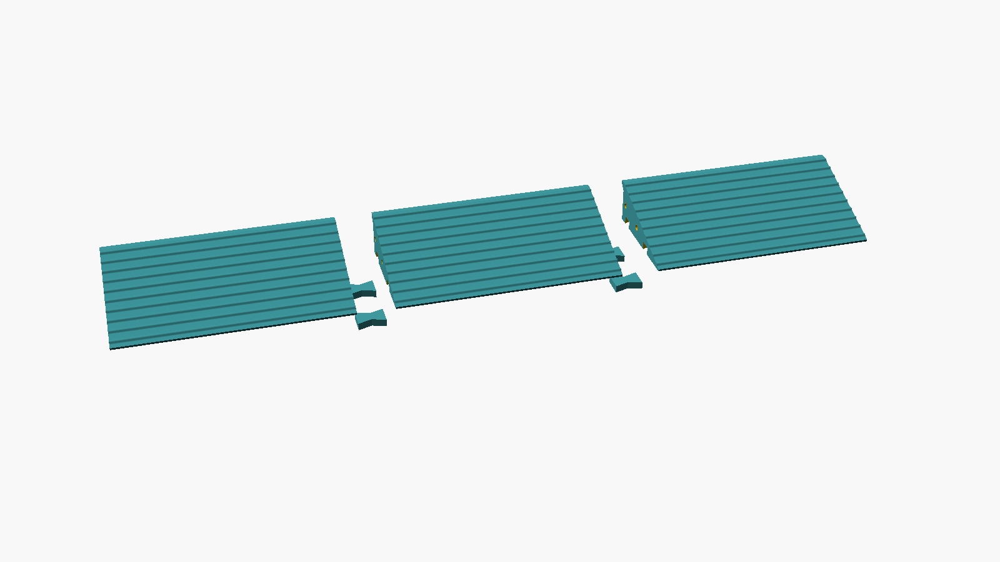
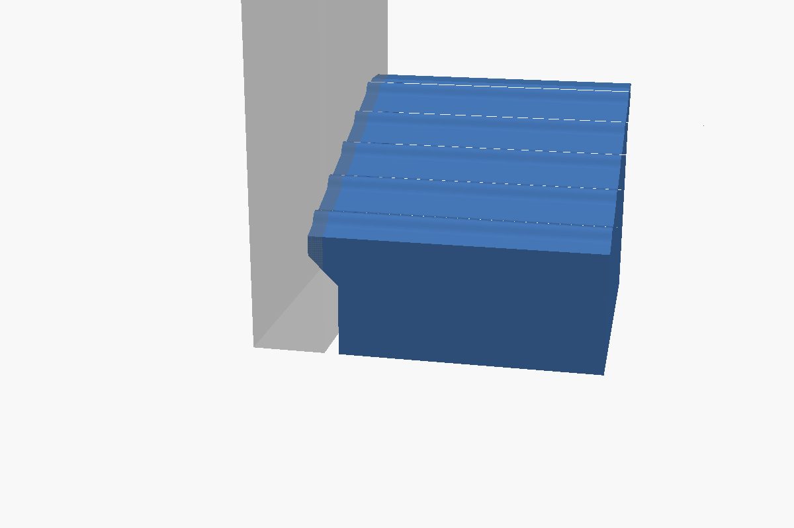

# Threshold slope, 723 × 120 × 46 mm

A wedge ramp with a 72.3 × 12 cm footprint. It is 4.6 cm tall at the back and
slopes down across the 12 cm depth to a 2 mm toe at the open front. The left
end, the right end and the back sit against walls. Each of those three sides
has a **trimmable scribe lip** that you file or sand to follow the uneven wall.



## Read this first

- **72.3 cm won't fit on a printer bed.** The ramp is cut into 3 pieces (243 mm
  each, for 250 mm+ beds such as the Prusa MK4 or Bambu X1/P1/A1) or 4 pieces
  (182 mm each, for 220 mm beds such as the Ender 3). Bow-tie keys and pins join
  them, and the joints get glued.
- **The slope is steep.** 44 mm of rise over 117 mm of run is about 1:2.7
  (20.6°). That's fine for stepping on and for rolling a bin or vacuum over. It's
  far too steep for a wheelchair (1:12 is the usual limit), and printed plastic
  gets slippery when wet or in socks. The raised ribs help. Grip tape helps more.
- **The floor carries the load, not the plastic.** The ramp is strong because it
  sits fully on the floor and only gets squeezed. If the floor dips under the
  thin front edge, that edge spans the dip and can crack. Bed it on a few
  beads of silicone or construction adhesive to fill any hollows.
- **It needs a lot of plastic.** Expect about 1.0 kg (25 % infill) to 1.3 kg (40 % infill) of
  filament and roughly 30–60 h of printing for the full set, depending on the printer.
- **In sunlight, print it in ASA.** PLA softens in a hot sun and PETG slowly
  degrades under UV. See [Material](#material).

## Files

| File | What |
|---|---|
| `threshold_slope.scad` | Parametric source. Open in OpenSCAD → Window → Customizer to change anything. |
| `stl/3-segments/segment_1_of_3.stl` … `3_of_3` | Left end (lip on left and back), middle (back lip only), right end. |
| `stl/3-segments/keys_and_pins.stl` | 4 bow-tie keys + 4 alignment pins (one plate). |
| `stl/4-segments/…` | Same set for 220 mm beds (6 keys + 6 pins). |
| `build.sh` | Re-exports every STL and image after you change parameters. |

All parts print in the orientation they're exported in: flat base down, no
supports. The lips have 45° chamfers underneath, the pin holes are teardrops,
and the key-pocket ceilings are short bridges (≤ 22 mm).

## Cross-section (looking along the long edge)

```
                                       |<- 6 mm ->|  scribe lip (trim to wall)
                               _______ ____________   z = 46
                       _______/        |          |   z = 42
               _______/                |       /
       _______/   rounded ribs on top  |    /     45 deg chamfer underneath
 _____/                                | /            z = 36
|  2 mm toe                            |  <- body face, 3 mm off the wall
+--------------------------------------+---------------------- floor
y = 0 (open front)                  y = 117      y = 123
                                       (nominal wall line y = 120)
```

The two end walls get the same lip and clearance, following the sloped top.
Below is the left end piece sliced through the middle of the slope, with the
wall shown in grey. The body stops 3 mm short of the wall, and the lip at the
top reaches 3 mm past the wall line, so it can be trimmed back to wherever
the wall actually is. The right end piece is a mirror image.



## Grip ribs

The slope has 10 raised ribs running along the length, 1.5 mm tall and 6 mm
wide, about 12.5 mm apart. Each rib has a smooth raised-cosine profile that
blends into the slope with no inside corner, so there are no slots to collect
dirt: a cloth or mop wipes straight over them. The top rib's crest stays below
the 46 mm top edge, so nothing sticks up at the step.

Rounded ribs grip less than sharp-edged ones, especially when wet. If that
turns out to be a problem, raise `rib_height` to 2 mm, or add clear grip tape
in the flat bands between the ribs.

## Before printing: measure

The walls are uneven, so take several measurements and set these in the
Customizer (or with `-D name=value` in `build.sh`):

| Parameter | Default | Set it to |
|---|---|---|
| `opening_length` | 723 | The **smallest** wall-to-wall measurement (front, middle, back; at floor level and at 46 mm up). |
| `depth` | 120 | The **smallest** front-to-back-wall measurement. |
| `height` | 46 | The step height at the back wall. |
| `wall_clearance` | 3 | How far the body is held off each wall. Increase it if a wall bulges in at floor level (thick plaster, a skirting bead). |
| `scribe_allowance` | 3 | How far the lip sticks out past the nominal wall line. Set it to (largest − smallest measurement) / 2 + 1 so the lip covers the widest gap. |
| `fit_left/right/back` | true | Turn off any side that isn't against a wall. |
| `segments` | 3 | 4 for a 220 mm bed, 5 for a 180 mm bed. |
| `ribs` | true | Raised, rounded anti-slip ribs running along the length. |
| `rib_height` / `rib_width` / `rib_pitch` | 1.5 / 6 / 12 | Rib size and spacing along the slope. The model refuses ribs so steep that they'd undercut on the downhill side. |

## Print settings

| Setting | Value |
|---|---|
| Material | ASA for sunlight (see below). PETG indoors. |
| Layer height | 0.2 mm, 0.4 mm nozzle. 0.16 mm or adaptive layer height gives a smoother slope that's easier to wipe. |
| Walls / perimeters | 4 |
| Top / bottom layers | 6 / 5 |
| Infill | 40 % gyroid (25 % works, see below) |
| Supports | None |
| Elephant-foot compensation | 0.2 mm, so the joint faces meet cleanly |
| Brim | 5 mm for ASA. For PETG, only if the corners lift. |

**If you expect to trim more than ~2 mm off a lip**, add a slicer modifier box
over the outer 10 mm of each wall side with 100 % infill. Then trimming cuts
into solid plastic instead of exposing infill.

## Material

**ASA** is the one to use where the ramp gets sunlight.

- It's made for outdoor use (car trim, garden fittings) and keeps its strength
  and colour under UV for years.
- It softens at about 100 °C. PETG softens at about 80 °C and PLA at about
  60 °C, and a ramp in direct summer sun gets hot, especially in a dark colour.
- Pick a light colour (white, light grey, beige). It stays cooler in the sun
  and wears in less visibly.
- Acetone dissolves ASA, so you can solvent-weld the joints instead of using
  epoxy (brush acetone on both faces and clamp).

The catch: ASA shrinks and warps like ABS, and these parts are 243 mm long and
almost solid. It needs an **enclosed printer** (Bambu P1S/X1, Prusa Core One,
or an open-frame printer in an enclosure), a 90–100 °C bed, a brim, and no
drafts. It also gives off styrene fumes while printing, so ventilate the room.

**No enclosure?** Use PETG in an opaque colour, then paint it or give it a
UV-resistant clear coat. Expect it to fade and turn brittle at the surface over
a few years in strong sun, faster than ASA. Avoid PLA anywhere it gets sun.

## Fitting and assembly

1. **Scribe each piece on its own, before gluing.** Put the left piece into its
   corner, run a pencil along the wall with a washer as a spacer, and trace the
   wall's shape onto the top of the lip. File, sand or knife the lip to the
   line. Repeat for the right piece, then the middle piece's back lip. (The
   full assembly is 6 mm oversize until the lips are trimmed, so it won't drop
   in.)
2. Dry-fit the pins (printed, or a 6 mm wooden dowel / M6 threaded rod cut to
   29 mm) and the bow-tie keys. The keys go into the pockets on the underside.
3. Glue: epoxy or CA on the joint faces, the pins and the keys. Assemble it
   upside down on a flat surface so the walking surface ends up flush.
4. Put a few beads of silicone or construction adhesive (or non-slip
   rubber matting) underneath and press it into place. This fills hollows in
   the floor and stops the ramp creeping forward when people step off it.

## Why it holds a person

- **Load path.** The ramp rests on the floor over its full footprint, so a
  person's weight only squeezes the plastic. There's no unsupported span to
  bend or break.
- **Worst case.** Take a 120 kg person with all their weight on one heel
  (about 25 × 30 mm) and a ×2 factor for stepping down hard: about 2.4 kN, or
  roughly 3 MPa under the heel. The 6 top layers spread that over a larger
  patch of infill. Typical compression tests put 40 % gyroid PLA or PETG
  at roughly 8–15 MPa (it varies with material and printer), so there's a
  healthy margin. 25 % gyroid still clears the load for normal walking.
- **Layer direction.** The part prints flat, so the load presses straight down
  through the layers, which is the strongest direction. Nothing in normal use
  pulls the layers apart.
- **The front edge.** For the first ~20 mm the ramp is only 2–10 mm thick,
  mostly top and bottom skin with a little infill between. Pressed flat
  against the floor that is plenty. It cracks only if the floor under it is
  hollow, which is why you bed it in adhesive.
- **Limits.** Stiletto heels will dent it. Don't use it as a ramp for
  wheelchairs or heavy rolling loads.
